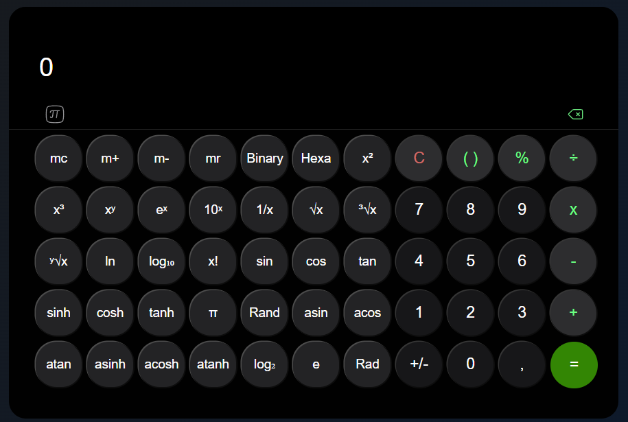

# 🧮 Calculadora Científica Web  

Una **calculadora web interactiva** que combina funciones básicas y científicas, ideal para realizar operaciones matemáticas avanzadas y conversiones de manera eficiente.  

 

## 🌟 **Características Principales**  

- **Modos de uso:**  
  - **Básico**: Realiza operaciones estándar como suma, resta, multiplicación y división.  
  - **Científico**: Accede a herramientas avanzadas con un diseño expandible.  

- **Operaciones matemáticas:**  
  - **Aritméticas**: `+`, `-`, `×`, `÷`, `%`, `±`  
  - **Trigonométricas**: `sin`, `cos`, `tan`, `asin`, `acos`, `atan`  
  - **Hiperbólicas**: `sinh`, `cosh`, `tanh`, `asinh`, `acosh`, `atanh`  
  - **Logarítmicas**: `ln`, `log₂`, `log₁₀`  
  - **Potencias y raíces**: `x²`, `x³`, `xʸ`, `√`, `³√`, `ʸ√`  
  - **Constantes matemáticas**: `π`, `e`  
  - **Conversiones numéricas**: Binario, hexadecimal  
  - **Funciones de memoria**: `MC`, `MR`, `M+`, `M-`  

- **Unidades angulares:** Soporte para radianes y grados.  
- **Previsualización en tiempo real:** Los resultados se muestran dinámicamente mientras escribes.  

## 🚀 **Cómo Usar**  

1. **Modo básico:**  
   - Realiza operaciones aritméticas estándar.  
   - Usa paréntesis `( )` para agrupar operaciones.  
   - Introduce decimales con `,` (el formato interno utiliza `.`).  

2. **Modo científico:**  
   - Haz clic en el botón  para expandir las opciones.  
   - Accede a más de 30 funciones adicionales.  

3. **Funciones especiales:**  
   - `Rand`: Genera números aleatorios.  
   - `x!`: Calcula el factorial de un número.  
   - `1/x`: Obtén el inverso multiplicativo.  
   - `+/-`: Cambia el signo de un número.  

## ⚙️ **Instalación**  

```bash
git clone https://github.com/WassimAarab08/Calculadora_Cientifica.git
cd calculadora-cientifica
# Abre index.html en tu navegador
```

🛠 **Tecnologías Utilizadas**

- **Frontend:**  
  - HTML  
  - CSS  
  - JavaScript  

- **Herramientas:**  
  - Visual Studio Code  
  - Git  

📌 **Notas**
- Los resultados se redondean a 4 decimales.
- La memoria (`MR`, `MC`) persiste durante la sesión.
- Usa `.` internamente para los decimales, pero la interfaz muestra `,`.

📄 **Licencia**
MIT License © 2025 WassimAarab08

🔨 **Mejoras Futuras**
- Añadir modo gráfico.
- Implementar historial de operaciones.
- Soporte para notación científica.
- Temas personalizables.

🐛 **Reportar Problemas**
Si encuentras algún error, por favor abre un issue.
